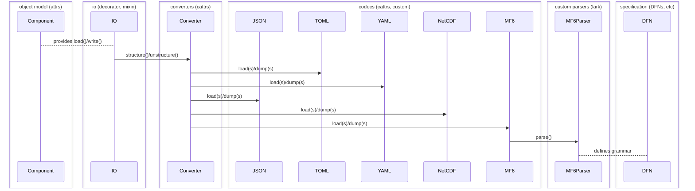

# Development notes

This project aims to reimplement MF6 support for flopy.

<!-- START doctoc generated TOC please keep comment here to allow auto update -->
<!-- DON'T EDIT THIS SECTION, INSTEAD RE-RUN doctoc TO UPDATE -->

- [Goals](#goals)
- [Principles](#principles)
  - [Separation of concerns](#separation-of-concerns)
- [Object model](#object-model)
  - [Plugin architecture](#plugin-architecture)
  - [How to define a class?](#how-to-define-a-class)
  - [Building on `attrs`](#building-on-attrs)
  - [Code generation](#code-generation)
- [Data model](#data-model)
    - [Arrays](#arrays)
    - [Tables](#tables)
- [IO](#io)
  - [Overview](#overview)
  - [Decorators](#decorators)
  - [Converters](#converters)
  - [Codecs](#codecs)
  - [Parsers](#parsers)

<!-- END doctoc generated TOC please keep comment here to allow auto update -->

## Goals

- existing `flopy.mf6` functionality intact
- easy for developers to read and debug
- fast read/write routines
- minimal code and maintenance burden
- Pythonic user-facing APIs

## Principles

### Separation of concerns

We want to avoid coupling FloPy's core framework to the MODFLOW 6 framework and
to the MODFLOW 6 input format. We want to separate abstract requirements, which
all hydrologic simulations might share, from details of the program's structure
and its expected input format. We want the same core framework to drive MODFLOW
6, MODFLOW 2005, LGR, NWT, GRIDGEN, etc &mdash; ideally any hydrologic simulator.

We also want to avoid polluting the core framework with post-processing details
like plotting, aggregations, input/output, etc.

IO, for instance, is at the boundary of an application and should only affect
the object model in rare instances.

## Object model

The FloPy framework can provide a set of basic types for
the input data model and its constituent parameters. The
former are nodes in the context tree, the latter leaves;
we want each component to be able to resolve any context
defined by its parent(s), up to the context tree's root.

### Plugin architecture

FloPy will consist of plugins, each defining a wrapper for a
given hydrologic program. Programs are expected to have well
defined input format specifications. FloPy will generate an
object model and data interface layer from these. Once these
exist, they *are* the specification, and we should be able
to introspect fields and derive specification documents from
them again.

The object model will use core functionality provided by
`attrs` (and some customizations) in a generic framework.

### How to define a class?

Python has several different ways to define composite data;
dictionaries, named tuples, standard classes, `dataclasses`.
The latter is an attempted remedy making it easier to give a
class a nice `__repr__`, structural equality, etc.

We want a nice OO user interface which provides both an input
specification and access to values as named attributes. This
can be achieved with `@dataclass` out of the box, the former
via `fields()`.

We also want things like:

- hierarchical namespacing
- nested context lookups, which gives us...
- parameters depending on other parameters
- parameters constrained by other parameters

...and more.

`dataclasses` is derived from an older project called `attrs`,
which has some extra powers.

### Building on `attrs` 

Object model classes inherit from a `Context` class and
define parameters as fields. Provide a `param()` function
wrapping `attrs.field()` which includes some metadata:

We provide a `param()` function wrapping `attrs.field()`
which includes metadata:

- `description`: str
- `deprecated`: bool

Parameters are primitives or composites of primitives:
union/record types (sum/product types, respectively).
Unions are achieved with `typing.Union`,
[products](https://en.wikipedia.org/wiki/Product_type)
with a custom class `Record`. 

The `Context` class [hooks into class initialization](https://www.attrs.org/en/stable/init.html#hooking-yourself-into-initialization)
to introspect its attributes and set up some machinery,
including parameter/component specification, signaling
apparatus for parameter dependencies, and more.

Peripheral concerns (e.g. plotting/exporting) can be
handled by mixins, so we can avoid polluting the core
classes and simultaneously avoid the diamond problem.

`Context` can also offer nice string representations:
  - `__str__`  of object model **classes** as human-readable (possibly condensed) specification
  - `__repr__` of object model **classes** as exact specification
  - `__str__` of object model **instances** as human-readable (possibly condensed) contents
  - `__repr__` of object model **instances** as full, complete contents

`Context` should act like (or be easily convertible to)
a dictionary.

### Code generation

Options:
- component generation as a developer task (as currently)
- defer MF6 component generation until install time? 
  - no need to version DFNs and generated files or decide when to sync them from MF6
  - could ship latest MF6 IO spec (DFNs, TOML or otherwise) with each flopy release
  - at first install time, flopy could use prepackaged spec to generate components
  - users could subsequently regenerate components from other versions of the spec
  - new command just to retrieve latest DFNs: `get_spec`? 
  - `generate_classes` no longer retrieves DFNs, just generates code
  - new command `migrate` = `get_spec` + `generate_classes`?
- dynamically create all classes?
  - makes debugging harder?

  TODO

## Data model

The data model should be agnostic to any program.
Ideally it would also be agnostic to dependencies,
but we view NumPy and Pandas as de facto standard
library Python and will accept them as primitives.

Parameters are Python primitives (`int`, `float`,
`bool`, `str`), `Path`, `numpy.typing.ArrayLike`,
`pd.DataFrame`, `Record`, or a union of records,
primitives, or strings/paths. Parameters must be
type-hinted in `Context` subclasses and defined
with `param()`.

If we ever see the need to provide array or table
abstractions of our own, we could take inspiration
from [astropy](https://github.com/astropy/astropy).

We recognize a distinction between two classes of
parameter: configuration and data parameters. We
acknowledge this distinction is not always valid,
but it is sometimes useful.

By default, we consider scalars, strings, paths,
records, and keystrings configuration parameters,
and load them eagerly. Consider arrays and tables
data parameters and load them lazily. This should
be configurable though.

Sometimes one wants a parameter name which collides
with a reserved Python keyword. `Context` subclasses
can use parameter names with a leading underscore to
avoid this; `MapAttrs` will set up an alias for any
param whose name isn't reserved.

#### Arrays

We should accept any `numpy.typing.ArrayLike` value,
whether it is standard `ndarray` or another flavor;
if it acts like an array, work with it.

We can offer an `ArrayLike` of our own if there is
a good case for it, e.g. constant or layered arrays:

- `ConstantArray`: store constant array as a scalar
- `LayeredArray`: convenient access to array layers

TODO more

#### Tables

We should accept any `pd.DataFrame` or subclass as
tabular input. We should make a distinction between
tabular (structured 2d list) and unstructured list
input; the latter is really just a list of records
or unions of records (keystrings).

## IO

### Overview

From the [principles](#principles):

> IO... is at the boundary of an application and should only affect
the object model in rare instances. It should never affect the domain model.

Access to IO can be unified with a decorator or mixin applied to object model classes,
which accesses a global registry of supported output formats and de/encoding machinery.
Defaults can be configured at this level.

Format can also be configurable on a per-simulation basis, or at read/write time
via method parameters.

IO can thus be separated into several layers:

- An `io` class decorator (or mixin) which provides `load` and `write` methods
  to the object model
- `cattrs` converters to map the object model to/from scalar/container
  primitives (un/structuring)
- Encoders/decoders for any number of serialization formats, which translate
  primitives to strings
- Custom codecs require a language specification and parser, which can be
  generated with `lark`

 

Output objects may consider aliasing `write()` to `export()` for consistency with the current FloPy convention.

TODO
  - handle external arrays separately from the input files referencing them
    - mapping of external file names to parameters
    - context manager class accepting the mapping as arg
    - simulation maintains mapping, passes it in load/write to a context manager
      - after all compononents written, ctx mgr writes all external files
    - apply to each component type, implement function decorator?
    - components register external arrays/lists to be read/written later
- support units e.g. via [pint](https://github.com/hgrecco/pint)?
  - maybe relevant/useful to pre-/post-processing
  - can pass thru to MF6 even though not required

### Decorators

TODO describe
- `@io`
- `@paired_file`
- `@paired_dir`

### Converters

TODO describe configuring/implementing `cattrs.Converter`

### Codecs

TODO describe implementing a codec

### Parsers

TODO: define grammar for MF6 input specification

- EBNF form? like https://github.com/toml-lang/toml/blob/1.0.0/toml.abnf
- At first, we implemented a very rough backtracking recursive descent parser
- Reimplement in [lark](https://lark-parser.readthedocs.io/en/latest/index.html)
- Define DFN grammar once: `flopy4/io/spec/dfn.lark`
- Regenerate input grammar with API: `flopy4/mf6/idm/idm.lark`
