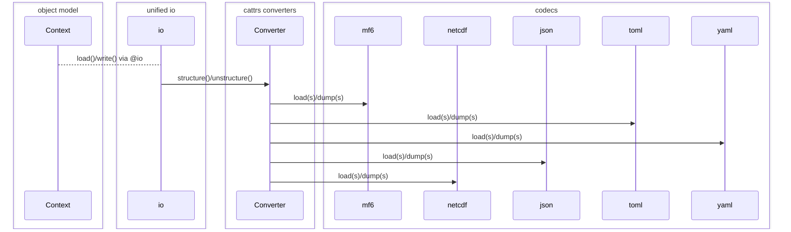

# Update 8/29/24

## Recap: where we were last month

We asked:

> What does FloPy need to do?

- Model (and interface with) a malleable domain: another program

We then asked:

> Which other systems solve similar problems?

- ORMs: Django, SQLAlchemy
- Web API clients

We identified a principle:

> The object model is the specification

We showed a proof of concept with

- hacky introspection for parameter/component specifications
- basic APIs for loading/writing/manipulating attribute values

### Successes

#### Procedures to read/write MF6 input files.

   We have a first draft of most of these, though they need more testing,
   and may be refactored for tidiness or speed as we go.

   This includes scalars, blocks, arrays and lists.

   These will form a basic building block going forward.

#### Pythonic user-facing APIs.

   No more `.get_data()`/`.set_data()`, etc, just get/set the attribute.
   The group seemed to like this.

### Problems

#### How many ways to define a class?

The Zen of Python #13 reads:

> There should be one &mdash; and preferably one &mdash; obvious way to do it.

Python, OO language of OO languages, in which everything is an object, offers
no single clear, concise way to define a class with desirable behaviors; like
a nice `__repr__`, structural equality, etc. The `dataclasses` module get us
part of the way there, but plenty of people probably throw up their hands and
just use dictionaries instead of a structured data representation.

We want to provide a nice OO user interface though, which we'll generate from a
set of templates, providing both an input specification and access to values as
named attributes. We also want things like:

- propagation of dependencies: parameters can be constrained by other parameters
- hierarchical namespacing
- ... and more.

It's nice if each object acts like a dictionary, but dictionaries won't cut it.

#### Separation of concerns

> *The object model is not the IO format*

At the end of the day, a program's real specification is a runtime property
of the program, which we aim to capture accurately in a natural language or
formal input specification.

In DRY spirit, we want the object model to *be* the specification, once we
generate it from the IO spec &mdash; it is then the single source of truth
about a program's expected inputs, allowing us flexibility to e.g. convert
the IO spec to a different format, or change the input format.

## New arrivals: `c/attrs` and friends

### Object model

The initial proof of concept had a hand-rolled method to introspect and attach a
block and parameter specification to classes in the simulation hierarchy. `attrs`
now handles this mostly on its own, with some utilities built on top: decorators
and mixins to give object model classes other convenient behaviors, like:

- acting like a dictionary
- situating themselves in a nested context hierarchy
- path resolution within a nested hierarchy
- enforcing constraints (validation)
- propagating dependencies/updates

Validation can be implemented with the builtin `attrs` validation mechanism:
(https://www.attrs.org/en/stable/examples.html#validators). The draft implementation
uses class decorators.

Dependency propagation can be achieved via a signaling mechanism where a nested
context broadcasts signals throughout itself; each node listens to a parent, if
it has one, and to its children, if it has any. Each parameters may register a
callback with its parent, to run when another parameter receives an update. The
dependent parameter need not be in the same class as the dependee. Classes can
opt in to this mechanism with class decorators.

### IO: decorators, converters, codecs

IO machinery is distinct from the object model. IO is at the boundary of an
application and should only affect the object model in very rare instances
(when otherwise unavoidable).

Previously we did not distinguish these. The object model took the MODFLOW 6
input format as its object model. This is problematic as we want to separate
abstract conceptual requirements from details of any input mechanism, so the
latter don't pollute the former.

IO can be separated into three layers:

1. An `io` class decorator (or mixin) which provides `load` and `write` methods
   to the object model
1. `cattrs` converters to map the object model to/from scalar/container
   primitives (un/structuring)
1. Encoders/decoders for any number of serialization formats, which translate
   primitives to strings

Access to the IO layer from the object model is unified via an `io` decorator or mixin,
which accepts a registry of converters. It may be useful for the converter and format 
to be configurable on a per-simulation basis, and/or on call to `read()` or `write()`.

## More inspiration

- [astropy](https://github.com/astropy/astropy) for IO interface
- [pyinaturalist](https://github.com/pyinat/pyinaturalist/tree/main) for `attrs`
